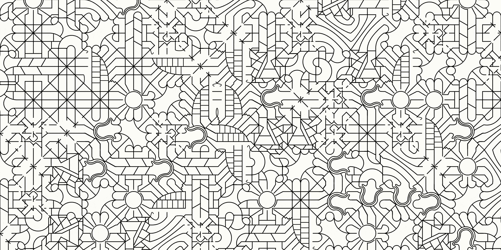

# Tileset Viewer

A generative art experiment in procedural tiling and pattern formation.

## Overview

This project displays a grid of tessellating tiles that I designed to seamlessly connect in any arrangement.
Each tile is randomly selected from a set of unique designs and displayed with varying rotations/orientations, creating unique patterns between the tiles.

This project explores:
* Procedural art and tiling systems
* Visual harmony through mathematical repetition
* The creative potential of randomness in design

## Features

* A set of unique tile designs that tessellate *perfectly*
* Randomized grid generation (tile type + orientation)
* Optional regeneration on refresh or double click
* Dynamic scaling to fit any screen size

## How It Works

Each tile follows specific connection rules that ensure every edge aligns cleanly with its neighbors.
When generating the grid, the algorithm:
* Randomly selects a tile from the set
* Randomly rotates it by 0°, 90°, 180°, or 270°
* Places it in the grid while maintaining seamless edges
* The result is a non-repeating pattern that still feels cohesive.

## Try It Out

You can view the project live here:
[Live Demo](https://isaacjcarnes.github.io/TilesetViewer/)

Or run it locally:
```
git clone https://github.com/IsaacJCarnes/TilesetViewer.git
cd Tileset-Viewer
npm install
npm run start
```

## Screenshots



## Future Plans

I am currently exploring overlaying color onto the result. Although it is not hard to add color using CSS alpha masking, it compromises the image quality in a way that ruins the tessellation. Therefore, I am looking to either fix the current implementation or migrate the project to new software with more visual control.
